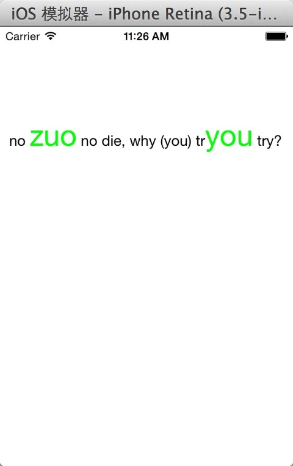

```
    HHAttributeLabel *label = [[HHAttributeLabel alloc]initWithFrame:CGRectMake(10, 100, 320, 200)];
    
    label.fontColor = [UIColor blackColor];
    label.font = [UIFont systemFontOfSize:16];
    
    label.specialColor = [UIColor greenColor];
    label.specialFont = [UIFont systemFontOfSize:32];
    
    label.text = @"no (zuo) no die, why (you) try?";
    [self.view addSubview:label];
```

